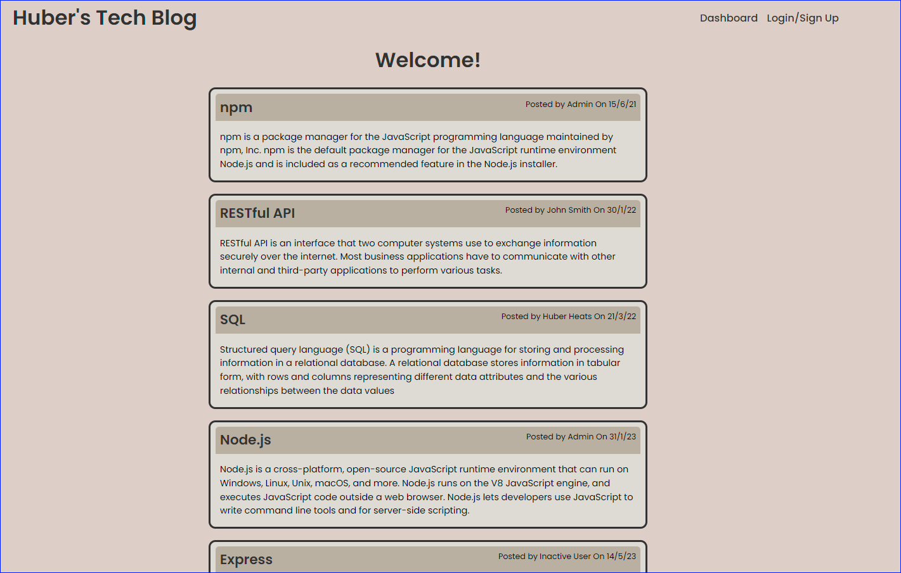
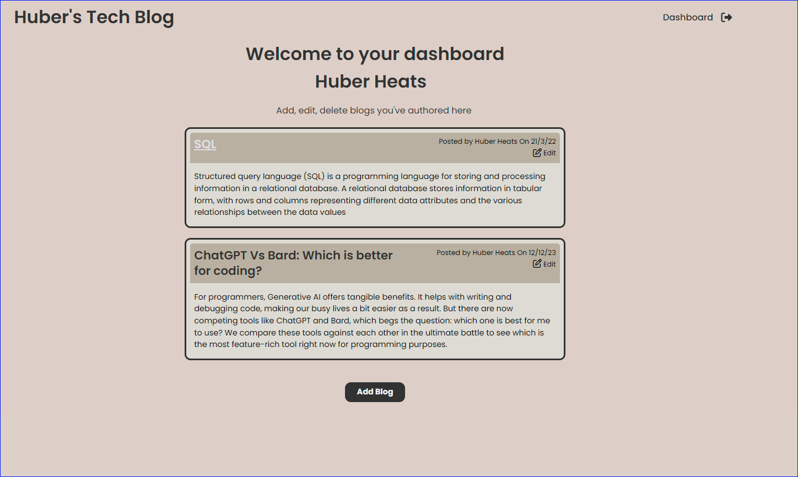

<a ID="readme-top"></a>

<div align="center">

# Huber's Tech Blog

[](https://opensource.org/licenses/MIT)
[](https://nodejs.org/en)
[](https://www.mysql.com/)
[](https://expressjs.com/)
[](https://www.npmjs.com/package/bcrypt)
[](https://www.npmjs.com/package/dotenv)
[](https://tailwindcss.com/)

Challenge 14 - Model View Controller (MVC)
</div>

## Description

Huber's Tech Blog is a website that allows users to publish blog posts and posts comments against blogs to generate discussion.

High level features of the forum are:

* User management (logging in, account creation)
* Ability for user to post blogs about topics of interest
* Ability for users to comment on blogs

This application is designed following the MVC paradigm without a base code.

## Table of contents

- [User Story](#user-story)
- [User Acceptance Critiera](#user-acceptance-criteria)
- [Installation](#installation)
- [Usage](#usage)
- [Screenshots](#screenshots)
- [License](#license)
- [Contributing](#contributing)
- [Testing](#testing)
- [Technologies Used](#technologies-used)
- [Questions](#questions)

## User Story <a ID="user-story"></a>

This forum was developed with this user story in mind:

```
AS A developer who writes about tech

I WANT a CMS-style blog site
SO THAT I can publish articles, blog posts, and my thoughts and opinions
```
<p align="right">(<a href="#readme-top">back to top</a>)</p>

## User Acceptance Criteria <a ID="user-acceptance-criteria"></a>

### This server was developed with the below User acceptance criteria:

```
GIVEN a CMS-style blog site

WHEN I visit the site for the first time
THEN I am presented with the homepage, which includes existing blog posts if any have been posted; navigation links for the homepage and the dashboard; and the option to log in

WHEN I click on the homepage option
THEN I am taken to the homepage

WHEN I click on any other links in the navigation
THEN I am prompted to either sign up or sign in

WHEN I choose to sign up
THEN I am prompted to create a username and password

WHEN I click on the sign-up button
THEN my user credentials are saved and I am logged into the site

WHEN I revisit the site at a later time and choose to sign in
THEN I am prompted to enter my username and password

WHEN I am signed in to the site
THEN I see navigation links for the homepage, the dashboard, and the option to log out

WHEN I click on the homepage option in the navigation
THEN I am taken to the homepage and presented with existing blog posts that include the post title and the date created

WHEN I click on an existing blog post
THEN I am presented with the post title, contents, post creator’s username, and date created for that post and have the option to leave a comment

WHEN I enter a comment and click on the submit button while signed in
THEN the comment is saved and the post is updated to display the comment, the comment creator’s username, and the date created

WHEN I click on the dashboard option in the navigation
THEN I am taken to the dashboard and presented with any blog posts I have already created and the option to add a new blog post

WHEN I click on the button to add a new blog post
THEN I am prompted to enter both a title and contents for my blog post

WHEN I click on the button to create a new blog post
THEN the title and contents of my post are saved and I am taken back to an updated dashboard with my new blog post

WHEN I click on one of my existing posts in the dashboard
THEN I am able to delete or update my post and taken back to an updated dashboard

WHEN I click on the logout option in the navigation
THEN I am signed out of the site

WHEN I am idle on the site for more than a set time
THEN I am able to view posts and comments but I am prompted to log in again before I can add, update, or delete posts

```

### Additional requirements:

* Application folder structure must follow Model-View-Conrtoller (MVC) paradigm
* Use of the following technologies
    * Express-handlebars
    * MySQL2
    * Sequelize
    * Express.js API for controllers
    * Manage environment variables via dotenv package
    * bcrypt package to has passwords
    * Express-session
    * Connect-session-sequelize

<p align="right">(<a href="#readme-top">back to top</a>)</p>

## Screenshots <a ID = "video-screenshots"></a>

### Screenshots

Screenshot of the Homepage listing all Blogs 
<div align="center">


</div>

Screenshot of response the User Dashboard to add, edit, delete their blogs
<div align="center">


</div>

<p align="right">(<a href="#readme-top">back to top</a>)</p>

## Installation

Huber's Tech Blog is deployed via Heroku (Utilising JawsDB as Database-as-a-service)
Installation is not required if accessing via the below link:

<a href="https://huber-tech-blog-ed7fd58460b2.herokuapp.com/"> Huner's Tech Blog (Heroku)" </a>

If you would like to Clonse or fork the repository to contribute then folow the below steps.

1. Clone or fork the repository
2. Run the below in console install necessary packages

```
npm i
```
3. After NPM packages have been installed, you'll need to set up your MySQL database for the application to read and write to. Log into MySQL2:
```
mysql -u root -p
```
4. Within mysql2 - create the datbase with the schema provided, run the below command in the root folder (the below is the relative path):
```
source ./db/schema.sql
```
5. Exit MySQL2:
```
quit
```
6. Optional - you can seed some data into the database while you are in mysql2 (Skip this step if you are going to use real data)
```
source ./seeds/seed.sql
```
7. You can run start the server once packages have been installed and the database is created. Run the below in the CLI:
```
node server.js
```

<p align="right">(<a href="#readme-top">back to top</a>)</p>

## Usage

* Access the home page of the Techblog to begin.
* The website allows users view only access to read blogs and comments.
* On the home page, clicking on a blog's title will open up the blog to show comments
* Comments can only be added once the user has signed in
* There is the option to sign up or log in and existing account to enable more features on the website
* Once signed in, a user can add comments against blogs
* The user will also have access to their dashboard which lists all blogs written by them.
* The user has the ability to add more blogs, edit exiting blogs or delete their blogs
* The website is configured so that sessions last 5 minutes (you will be logged out after this time elapses and will require logging in again)

<p align="right">(<a href="#readme-top">back to top</a>)</p>

## License

[](https://opensource.org/licenses/MIT)

This application can be used in conjunction with licensing covered in  <b>MIT Lcensee</b>

(Click on the badge for details of the license)

<p align="right">(<a href="#readme-top">back to top</a>)</p>

## Contributing

To contribute to this application, please reach out to me via my contact details below

<p align="right">(<a href="#readme-top">back to top</a>)</p>

## Testing

Automated Test scripts have not been developed for this application


<p align="right">(<a href="#readme-top">back to top</a>)</p>

## Technologies used <a ID="technologies-used"></a>

- **Node.js**: Runtime environment for executing server-side JavaScript code.
- **Express**: Web application framework for building RESTful APIs.
- **Express-Handlebars**: Template engine for rendering HTML templates.
- **Express-Session**: Middleware for managing user sessions.
- **MySQL2**: MySQL database driver for Node.js.
- **Sequelize**: Promise-based ORM for interacting with databases.
- **Bcrypt**: Library for securely hashing passwords.
- **Dotenv**: Utility for loading environment variables.
- **Tailwind CSS**: Utility-first CSS framework for styling the application's frontend.
- **JawsDB**: Providing managed MySQL databases, ideal for scalable web applications.
- **Heroku**: A cloud platform that offers easy deployment and management of web applications.

**Development Tools**:

- **Nodemon**: Development tool for auto-reloading the server during development.

<p align="right">(<a href="#readme-top">back to top</a>)</p>

## Questions

- Visit my GitHub page: <a href="https://github.com/hybee234"> hybee234 </a>
  
<p align="right">(<a href="#readme-top">back to top</a>)</p>

